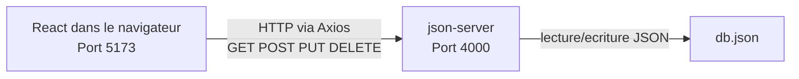
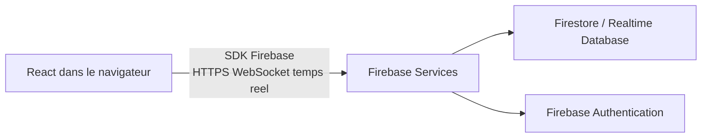
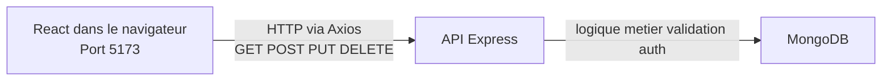

# TaskFlow - TP Material UI, Bootstrap et Architecture

## Lancement du projet

### Backend

```bash
npx json-server --watch db.json --port 4000
```

### Frontend

```bash
npm run dev
```

Le frontend tourne sur `http://localhost:5173` et l'API `json-server` sur `http://localhost:4000`.

## Partie 1 - Header avec Material UI

`HeaderMUI.tsx` a ete cree et le dashboard utilise temporairement `HeaderMUI` a la place du header CSS module pour le test.

### Q1. Combien de lignes de CSS avez-vous ecrit pour le Header MUI ? Comparez avec votre Header.module.css.

Pour `HeaderMUI`, j'ai ecrit **0 ligne de CSS** dans un fichier separe.

Comparaison :

- `HeaderMUI` : `0` ligne de CSS externe
- `Header.module.css` : `53` lignes

Conclusion : avec Material UI, le style du header est integre directement dans le composant via `sx={{}}`, donc on supprime completement le fichier CSS dedie pour cette partie.

## Partie 2 - Login avec Material UI

`LoginMUI.tsx` a ete ajoute. La logique d'authentification reste la meme que dans le composant `Login.tsx`, mais l'interface est construite avec les composants MUI.

## Partie 3 - Header avec Bootstrap

`HeaderBS.tsx` a ete cree et Bootstrap a ete installe avec son import global dans `src/main.tsx`.

### Q2. Comparez le code du Header MUI vs Bootstrap. Lequel est plus lisible ? Plus court ?

Le header Bootstrap est **legerement plus court** et souvent plus facile a lire au premier coup d'oeil si on connait deja les classes Bootstrap comme `ms-auto`, `fw-bold` ou `gap-3`.

Le header Material UI est **plus explicite cote React**, car toute la structure et le style restent dans les props des composants (`AppBar`, `Toolbar`, `Typography`, `sx`).

Mon bilan :

- **Plus court** : Bootstrap
- **Plus lisible pour un projet React structure** : Material UI

Bootstrap gagne en compacite. Material UI gagne en coherence entre structure, composants et personnalisation.

## Partie 4 - Login avec Bootstrap

`LoginBS.tsx` a ete cree en reprenant exactement la meme logique que `LoginMUI` : `useState`, `dispatch`, `handleSubmit`, appel Axios, verification du mot de passe et gestion des erreurs. Seul le JSX change.

### Q3. Le Login MUI utilise sx={{}} pour le style. Le Login Bootstrap utilise des classes CSS. Quel systeme preferez-vous ? Pourquoi ?

Je prefere **le systeme `sx={{}}` de Material UI** pour ce projet.

Pourquoi :

- le style est proche du composant, donc plus rapide a maintenir
- il y a moins d'aller-retour entre JSX et fichier CSS
- la personnalisation est plus fine et plus naturelle dans un projet React
- l'integration avec un theme global est meilleure si l'application grandit

Bootstrap reste tres pratique pour aller vite, mais `sx` me donne plus de controle composant par composant.

## Partie 5 - Tableau comparatif

| Critere | Material UI | React-Bootstrap |
| --- | --- | --- |
| Installation | `npm install @mui/material @emotion/react @emotion/styled @mui/icons-material` | `npm install react-bootstrap bootstrap` |
| Nombre de composants utilises | 10 composants principaux + 1 icone | 7 composants principaux |
| Lignes de CSS ecrites | 0 | 0 |
| Systeme de style | `sx={{}}`, props, theme | classes Bootstrap + styles inline si besoin |
| Personnalisation couleurs | Tres bonne, precise, themable | Bonne, mais plus dependante des variantes/classes |
| Responsive | Bon, surtout avec le systeme MUI | Bon, tres rapide avec les classes utilitaires |
| Lisibilite du code | Bonne, tres React | Bonne, plus concise si on connait Bootstrap |
| Documentation | Tres riche et tres complete | Claire et simple a prendre en main |
| Votre preference | Material UI | Bon choix pour prototypage rapide |

### Q4. Si vous deviez choisir UNE seule library pour TaskFlow en production, laquelle et pourquoi ?

Je choisirais **Material UI** pour TaskFlow en production.

Raisons principales :

- meilleure integration avec React
- personnalisation plus propre avec `sx` et le theming
- catalogue de composants tres riche pour faire evoluer l'app
- architecture plus facile a garder coherente sur le long terme

Bootstrap est efficace pour aller vite, mais pour une application qui va grandir, MUI offre un meilleur cadre.

## Partie 6 - Architecture Base de Donnees

### Architecture actuelle avec json-server



Explication :

- React envoie les requetes HTTP via Axios
- `json-server` expose une API REST locale
- `db.json` sert de stockage fichier pour les ressources `users`, `projects` et `columns`

### Architecture si on remplacait json-server par Firebase



Resume : React -> SDK Firebase -> services Firebase.

### Architecture si on remplacait json-server par Express + MongoDB



Resume : React -> Axios -> Express API -> MongoDB.

### Q5. Pourquoi React ne peut-il PAS se connecter directement a MySQL ?

React ne doit pas se connecter directement a MySQL pour plusieurs raisons :

- il faudrait exposer les identifiants de base de donnees dans le navigateur, ce qui est interdit en pratique
- MySQL est concu pour des connexions serveur, pas pour des clients web publics
- on a besoin d'un backend pour faire la validation, l'authentification, l'autorisation et la logique metier
- le navigateur fonctionne surtout en HTTP/HTTPS, alors que MySQL utilise son propre protocole reseau

Donc, en architecture web normale, **le frontend parle a une API**, et **l'API parle a la base de donnees**.

### Q6. json-server est parfait pour notre TP. Donnez 3 raisons pour lesquelles on ne l'utiliserait PAS en production.

Trois raisons principales :

1. Il n'y a pas de vraie securite backend : pas de gestion serieuse des droits, de l'auth ou de la validation metier.
2. Ce n'est pas adapte a la scalabilite ni a la concurrence reelle de plusieurs utilisateurs.
3. Le stockage dans un fichier JSON n'est pas robuste pour une vraie application en production.

On peut aussi ajouter qu'il ne fournit ni logique metier complexe, ni monitoring, ni transactions fiables.

### Q7. Firebase permet a React de se connecter directement. Comment est-ce possible alors que MySQL ne le permet pas ?

Firebase le permet parce qu'il ne s'agit pas d'une base de donnees brute exposee comme MySQL.

Firebase fournit :

- un **SDK client officiel** pour le navigateur
- une **authentification integree**
- des **regles de securite** cote service
- une infrastructure backend geree par Google

Autrement dit, React ne parle pas directement a un serveur SQL prive. Il parle a une **plateforme cloud prevue pour les clients web**, securisee par des regles et des tokens.

## Partie 7 - Questions de reflexion

### Q8. Votre TaskFlow utilise json-server. Un client vous demande de passer en production avec de vrais utilisateurs. Quelles etapes sont necessaires ?

Les etapes principales seraient :

1. Remplacer `json-server` par un vrai backend comme Express, NestJS ou Firebase.
2. Ajouter une vraie base de donnees comme PostgreSQL, MySQL, MongoDB ou Firestore.
3. Mettre en place une authentification reelle avec hash des mots de passe et gestion de sessions ou JWT.
4. Ajouter validation des donnees, autorisations et protection des routes/API.
5. Gerer les variables d'environnement et retirer toute configuration sensible du frontend.
6. Ajouter tests, logs, monitoring et gestion des erreurs.
7. Deployer frontend et backend sur une infrastructure de production.

### Q9. MUI et Bootstrap sont des libraries externes. Quel est le risque d'en dependre ?

Les principaux risques sont :

- augmentation de la taille du bundle si on importe beaucoup de composants
- dependance a des changements de version qui peuvent casser le code
- cout de maintenance quand la librairie change d'API ou de conventions
- risque de lock-in visuel ou technique si tout le design depend fortement de la librairie

Il faut donc choisir une librairie utile, mais garder une architecture assez propre pour pouvoir faire evoluer l'application.

### Q10. Vous devez creer une app de chat en temps reel. json-server, Firebase ou Backend custom ? Justifiez.

Je choisirais **Firebase** parmi ces trois options.

Justification :

- `json-server` ne gere pas le temps reel de maniere serieuse
- Firebase propose deja le temps reel, l'auth, l'hebergement de donnees et des SDK clients
- pour un chat, on gagne enormement de temps de developpement

Si le projet devenait tres complexe avec moderation avancee, analytics specifiques, regles metier tres poussees ou contraintes fortes de cout, un backend custom pourrait redevenir le meilleur choix. Mais pour lancer un chat moderne rapidement, Firebase est le plus adapte.

## Resume final

- `HeaderMUI.tsx` a ete cree et branche temporairement dans le dashboard
- `HeaderBS.tsx` a ete cree
- `LoginMUI.tsx` a ete cree
- `LoginBS.tsx` a ete cree
- Bootstrap est importe globalement dans `src/main.tsx`
- le README precedent a ete supprime et remplace par les reponses de ce TP